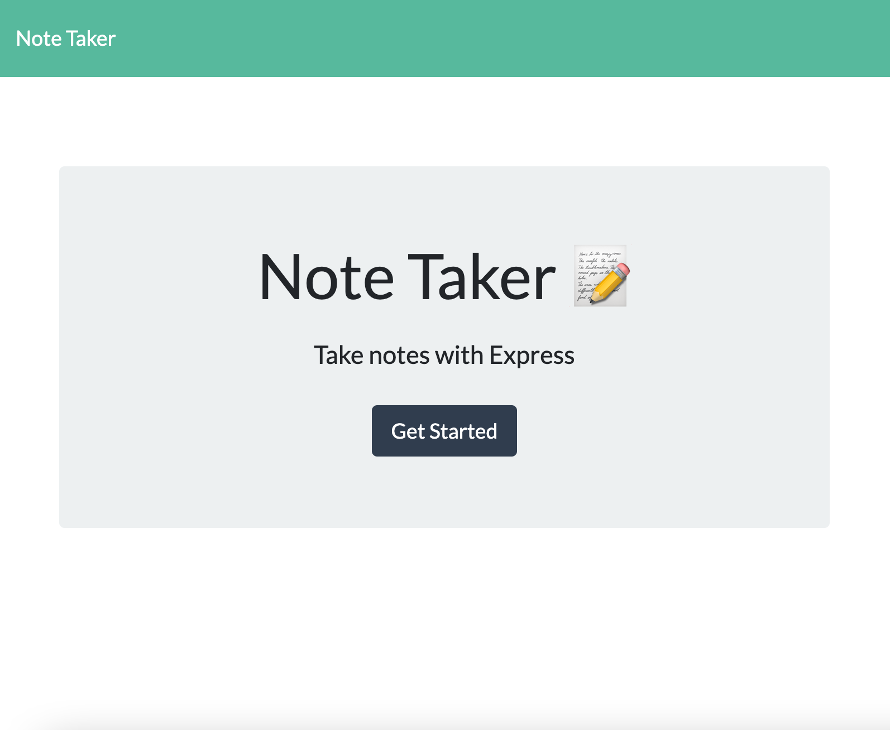
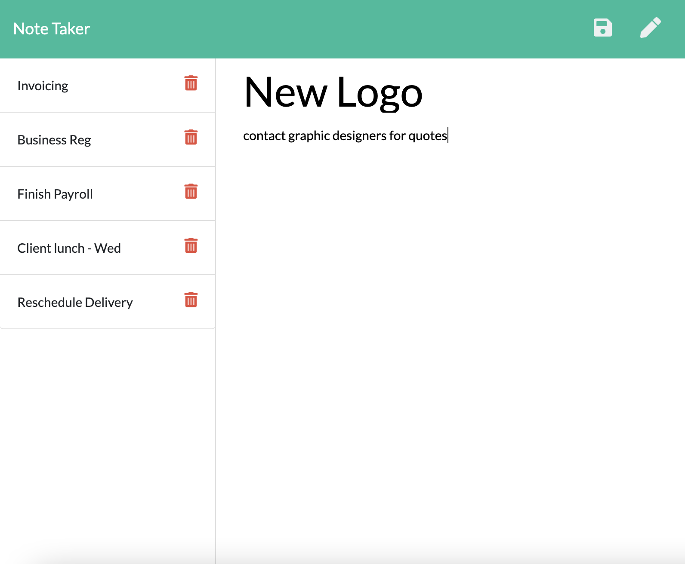

# Homework11-NoteTaker
Repository for Homework 11 - Note Taker

## An Express.JS Note Taker

AS A small business owner  
I WANT to be able to write and save notes  
SO THAT I can organize my thoughts  and keep track of tasks I need to complete  

### Note Taker Screenshots
  

### App Instructions:
1. Open the Note Taker app  
2. Click on the link to access the note taker page. The user is presented with existing notes listed in the left-hand column, plus empty fields to enter a new note title and the note’s text in the right-hand column  
3. Enter a note title and note text.  
4. Click on the Save icon that appears in the top right side of the page to save the note. It now appears in the left-hand column.  
  
5. View an existing note - Click on an existing note in the left-hand column to view in the right-hand column.  
6. Creat a new note - Click on the Write icon in the navigation top of the page to be presented with empty fields to enter a new note.  
7. Delete a note - click on the Delete icon to the right of an existing note.
  